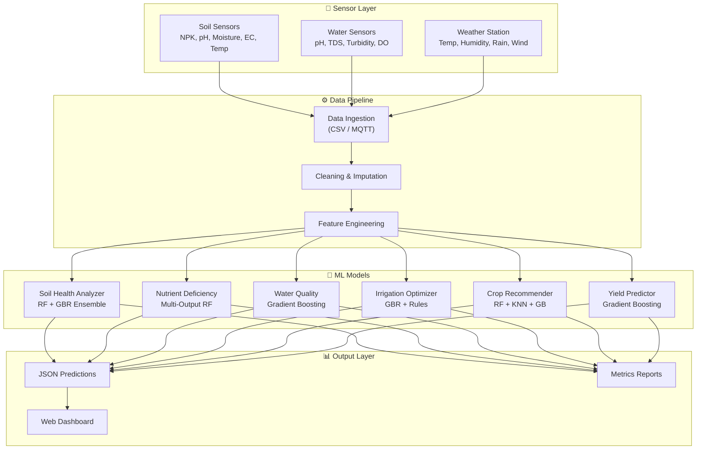
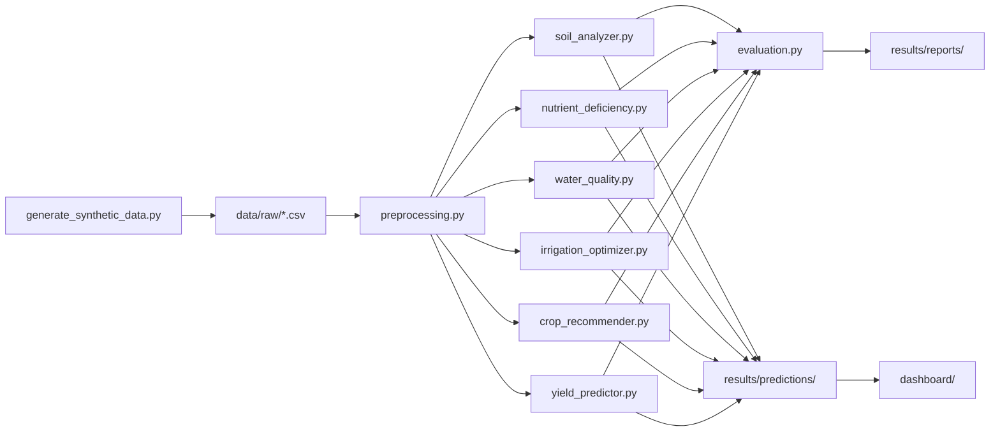

# AgriSense AI — System Architecture

## Overview

AgriSense AI follows a **layered pipeline architecture** where data flows from physical sensors through preprocessing, ML inference, and into a visualization dashboard.



## Technology Decisions

| Decision | Choice | Rationale |
|----------|--------|-----------|
| ML Framework | scikit-learn | Well-documented, production-ready, sufficient for tabular data |
| Ensemble Method | Voting (RF + GBR) | Combines stability of RF with gradient boosting accuracy |
| Class Balancing | Sample weights | Simpler than SMOTE, avoids synthetic minority samples |
| Dashboard | Vanilla HTML/CSS/JS | Zero build tools, opens anywhere, no Node.js needed |
| Charts | Chart.js (CDN) | Lightweight, responsive, great dark theme support |
| Data Format | CSV → JSON | CSV for training, JSON for dashboard consumption |

## Data Flow

### Training Flow
```
Sensors → CSV files (data/raw/)
         → Preprocessing (models/utils/preprocessing.py)
         → Feature engineering (NPK ratios, ETo, heat index)
         → Train/Test split (80/20)
         → Model training with cross-validation
         → Metrics saved (results/reports/)
         → Predictions exported (results/predictions/)
```

### Inference Flow
```
New sensor reading (dict)
         → Load saved model (.joblib)
         → Scale features with saved scaler
         → Model.predict()
         → Post-process (categorize, recommend)
         → Return JSON response
```

## Module Dependency Graph



## Zone Architecture

The farm is divided into 8 sensor zones, each with distinct soil characteristics:

| Zone | Soil Type | Characteristics | Assigned Crop |
|------|-----------|----------------|---------------|
| Zone 1 | Loamy | Balanced, high retention | Rice |
| Zone 2 | Clay | Heavy, waterlogged risk | Wheat |
| Zone 3 | Sandy | Low retention, drains fast | Maize |
| Zone 4 | Silt | Good nutrients, moderate | Soybean |
| Zone 5 | Loamy | Nutrient-rich, productive | Cotton |
| Zone 6 | Clay Loam | Heavy but fertile | Sugarcane |
| Zone 7 | Sandy Loam | Light, needs frequent water | Potato |
| Zone 8 | Peaty | Organic-rich, acidic | Tomato |
